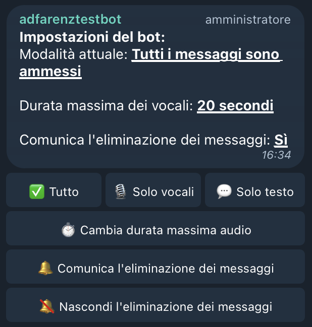
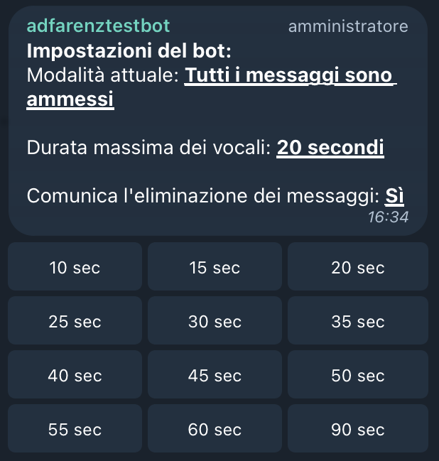

# ADFarenz Audio Telegram Bot
🇬🇧 Node.js Telegram Bot to manage messages in groups (every message allowed, only audio messages allowed or only text/media messages allowed).

🇮🇹 Bot di Telegram in Node.js usato per gestire i messaggi nei gruppi (per accettare tutti i messaggi, solo i vocali oppure solo i messaggi di testo/media).

</img> </img>

Creato inizialmente per l'utilizzo nella chat **ADFarenz: audio su twitch**

*Made with: [node-telegram-bot-api](https://github.com/yagop/node-telegram-bot-api)*
